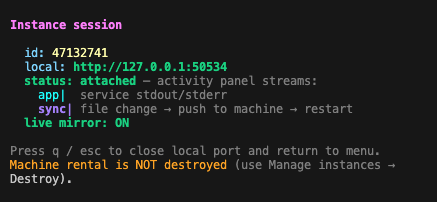

# vllm-serve — RTX 4090 + Qwen3.5-4B

| | |
|--|--|
| **Image** | `vllm/vllm-openai:v0.26.0` (official) |
| **GPU** | RTX 4090 × 1 |
| **Model** | `Qwen/Qwen3.5-4B` |

Use a **ready image**, not a thin pytorch runtime + install hacks.

## Run

```bash
cd vllm_serve
vkong run -C . --destroy=false --keep-alive
```

> **Note:** Local port changes each session. Check `vkong` output for the actual port (e.g. `http://127.0.0.1:50534`).

When finished, run `vkong app stop vllm-serve` to destroy the active rental and stop billing.



## Smoke test

```bash
# List models
curl -fsS http://127.0.0.1:<local-port>/v1/models | head -c 800

# Chat completion
curl -fsS http://127.0.0.1:<local-port>/v1/chat/completions \
  -H "Content-Type: application/json" \
  -d '{
    "model": "Qwen/Qwen3.5-4B",
    "messages": [{"role": "user", "content": "Say hi in one short sentence."}],
    "max_tokens": 64,
    "temperature": 0.2
  }'
```

## Python client

```bash
pip install openai
VKONG_URL=http://127.0.0.1:<local-port> python client.py
```

## Env (optional)

| Variable | Default |
|----------|---------|
| `MODEL` | `Qwen/Qwen3.5-4B` |
| `MAX_MODEL_LEN` | `2048` |
| `GPU_MEMORY_UTILIZATION` | `0.9` |
| `PORT` | `8000` (set by vkong) |
